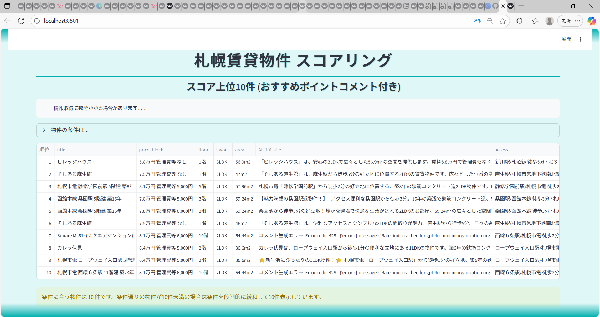

# 【ヤフー賃貸】札幌賃貸物件スクレイピング & スコアリングアプリ

## プロジェクト概要
札幌市中央区・北区の賃貸物件をスクレイピングし、特定ペルソナの重視条件に基づいて独自のスコアリングロジックでランキング表示する **Streamlit アプリ**です。  

物件の魅力を簡潔に伝える「おすすめコメント」も自動生成します。

### 解決する課題
- 多数の物件の概要を効率よくふるいにかけられる
- **一覧ページ→詳細ページ→戻る→再検索**という繰り返し作業を代行し、  
  ユーザーが重視する条件順に整理して表示

---

## ターゲットユーザー / ペルソナ
**30代女性**  
- 子供が一人、正社員でフルタイム勤務  
- 会社は札幌駅近郊、通勤30分圏内希望  

### なぜこのペルソナに焦点を当てたか
自分自身の経験に基づき、子どもがいると物件比較に時間をかけられないという課題があるため。

---

## 機能一覧
- **Yahoo賃貸からの物件情報スクレイピング**
- **特定間取りの除外**（1K, 1LDK, 1DK, 2K, 2DK, ワンルーム）
- **ペルソナ重視条件に基づく独自スコアリング**
  - 間取り：2LDK＝2点、3～10LDK＝3点
  - 面積：50㎡＝2点、55㎡＝3点
  - 家賃：8万円以下＝2点、6万円以下＝3点
  - 駅徒歩：10分以内＝2点、5分以内＝3点
  - 築年数：10年以内＝2点、5年以内＝3点
  - 指定駅（西11丁目、西18丁目、バスセンター、菊水）＝2点
  - 指定駅（札幌、さっぽろ、北12条、北18条、大通、すすきの、中島公園、幌平橋）＝3点
  - 敷金なし＝1点
  - 礼金なし＝1点
- **CSV保存**（`results.csv`）
- **Streamlit Web表示**
  - スコア上位10件を表示
  - ソート、カラム表示/非表示
- **AIによるおすすめコメント生成**

---

## ペルソナが重視する条件とスコアリング
- **札幌市中央区または北区の物件**
- **2LDK以上、45㎡以上**
- **駅徒歩10分以内**
- **築年数10年以内**
- **家賃が安いほど高評価**
- **敷金・礼金がないほど高評価**

> 許容範囲は2点、理想に近い場合は3点を加点

---

## 使用技術
- **Python, Selenium, BeautifulSoup, pandas, Streamlit**
- **driver.py**：Selenium WebDriver 設定
- **OpenAI API**：おすすめコメント生成で利用

---

## プロジェクト構成
sapporo_rent_scraper_fixed/

├── app.py # Streamlit アプリ（スコア表示 & コメント表示）

├── main.py # 全体実行のエントリーポイント

├── config.py # 設定ファイル

├── data_cleaner.py # データ整形スクリプト

├── driver.py # Selenium WebDriver 初期化

├── generate_comments.py # AI コメント生成

├── get_details.py # 物件詳細ページ取得

├── scraper/

│ ├── init.py

│ └── property_scraper.py # スクレイピング処理

├── comments.csv # 生成されたおすすめコメント

├── results.csv # 最新のスクレイピング結果

├── results_YYYY-MM-DD.csv # 日付付き実行結果

├── README.md # プロジェクト説明

└── .env # APIキー等の環境変数

---

## 実行方法

### 1. 環境構築
1. Python 3.10+ をインストール
2. 依存ライブラリをインストール
   
   `pip install -r requirements.txt`

### 2. WebDriver 設定

Chrome WebDriver をインストールし、パスを通しておく

### 3. APIキー設定

プロジェクトルートに `.env` ファイルを作成し、OpenAI APIキーを記載してください。

OPENAI_API_KEY=sk-xxxxxxxxxxxxxxxxxxxxxxxx

※ `.env` は `.gitignore` に追加しているため、GitHubにはアップロードされません。

### 4.実行手順

- スクレイピングを実行（CSV生成）

　　　`python main.py`

- Streamlit アプリを起動

　　　`streamlit run app.py`

→ Webブラウザが自動で起動し、数分後にランキング結果が表示されます

## 実行結果

**表示内容**

順位、タイトル、賃料、間取り、面積、アクセス、築年数、敷金・礼金、スコア、おすすめコメント、物件リンク

**スクリーンショット：**

**StreamlitアプリのURL：**                                            
https://sappororentscraperfixed-ephaed8es35af4vvturrhm.streamlit.app/

**実行デモ動画(1:15)：**                                               
https://1drv.ms/v/c/aa77078cc99cfacf/EQ30pYW5ITxBlSkHYgYXMEIB-EKeImoFcViFGa_t60cj9Q

## 技術的ハイライト

- ペルソナに最適化したスコアリングロジック
- Yahoo!賃貸ページ構造の変化に対応できるスクレイピング
- Streamlitを用いた動的UI構築

## 今後の展望

- 結果の「いいね」機能、履歴保持
- Streamlit上での検索条件変更UI
- AIコメント生成の精度向上

 
 

***
English Version

# [Yahoo! Real Estate] Sapporo Rental Scraping & Scoring App

## Overview
This **Streamlit application** scrapes rental listings from Yahoo! Real Estate (Sapporo’s Chuo and Kita wards) and ranks them using a custom scoring logic tailored to a specific persona.  

It also generates short **recommendation comments** automatically.

### Problem Solved
- Quickly filter large numbers of listings
- Automates the repetitive cycle of  
  **list page → detail page → back → search again**
- Displays results in order of conditions that matter most to the target user

---

## Target Persona
**Female, 30s**  
- One child, full-time employee  
- Works near Sapporo Station, wants to commute within 30 minutes  

**Why this persona?**  
Based on personal experience: with a child, comparing listings takes too much time.

---

## Features
- Scraping rental data from **Yahoo! Real Estate**
- Excluding specific layouts (1K, 1LDK, 1DK, 2K, 2DK, Studio)
- **Scoring logic** based on persona priorities  
  - Layout: 2LDK = +2, 3–10LDK = +3  
  - Floor area: 50㎡ = +2, 55㎡ = +3  
  - Rent: ≤80,000 JPY = +2, ≤60,000 JPY = +3  
  - Walk to station: ≤10 min = +2, ≤5 min = +3  
  - Age: ≤10 years = +2, ≤5 years = +3  
  - Preferred stations (e.g., Sapporo, Odori, Susukino, Nakajima Koen) = +2/+3  
  - No deposit = +1, No key money = +1
- Save results to **CSV (results.csv)**
- **Streamlit web interface**
  - Top 10 ranked properties
  - Sorting, column toggle
- **AI-generated recommendation comments**

---

## Tech Stack
- **Python, Selenium, BeautifulSoup, pandas, Streamlit**
- **OpenAI API** (comment generation)
- **driver.py**: Selenium WebDriver settings  

---

## Project Structure
sapporo_rent_scraper_fixed/

├── app.py # Streamlit app (UI & comments)

├── main.py # Entry point

├── config.py # Config

├── driver.py # Selenium setup

├── generate_comments.py # AI comment generation

├── get_details.py # Fetch details

├── scraper/

│ └── property_scraper.py

├── results.csv

├── README.md

└── .env # Environment variables (API key)

---

## Setup & Usage

### 1. Environment
- Install Python 3.10+  
- Install dependencies:  
pip install -r requirements.txt

### 2. WebDriver
Install **Chrome WebDriver** and add it to PATH.

### 3. API Key
Create `.env` file in the project root:

OPENAI_API_KEY=sk-xxxxxxxxxxxxxxxxxxxxxxxx

※ `.env` is ignored by Git (.gitignore)

### 4. Run
- Scraping (generate CSV):
python main.py

- Launch Streamlit app:
streamlit run app.py

Browser will open and display ranked results.

---

## Output
- Rank, Title, Rent, Layout, Floor Area, Access, Age, Deposit/Key money, Score, Comment, Link  

Demo Video (1:15):  
https://1drv.ms/v/c/aa77078cc99cfacf/EQ30pYW5ITxBlSkHYgYXMEIB-EKeImoFcViFGa_t60cj9Q  

---

## Highlights
- Scoring logic optimized for persona needs
- Robust scraping against Yahoo! Real Estate structure changes
- Dynamic UI via Streamlit  

---

## Future Work
- “Like” feature & history
- Search condition UI in Streamlit
- Deployment
- Improve AI comment generation

